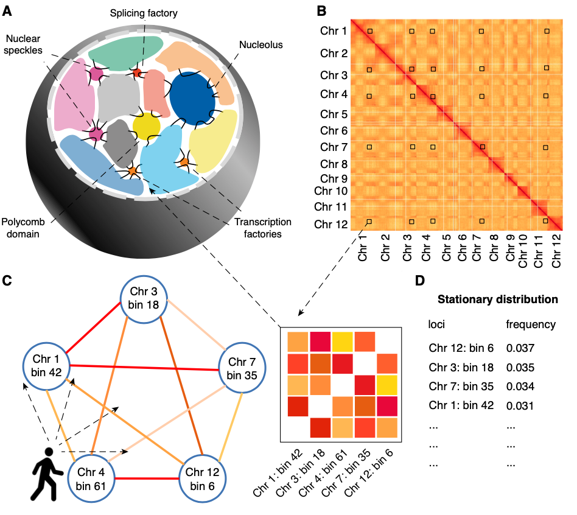

# trans-C
### Identification of *trans* interacting DNA domains

Trans-C is a tool that finds in Hi-C data biologically meaningful sets of loci that interact strongly in *trans*. 

It initiates probabilistic random walks with restarts from a set of seed loci to traverse an input Hi-C contact map and returns dense subnetwork containing the seed loci.

You can find more about the theory behind trans-C by reading our [paper](link.pdf). If you use Trans-C in an academic setting please cite us.

### Dependencies
Trans-C is implemented in Python and uses the common numpy, sklearn, and scipy packages. Additionally, it relies on the iced and cooler packages, so make sure to install these dependencies (*pip* or *conda* install work effortlessly). We recommend using the [conda](https://conda.io/projects/conda/en/latest/index.html#) tool for package and environment management.

### Inputs

Trans-C has five required inputs:
1. **Hi-C matrix.** This is the matrix that captures the genomic loci interactions and the main input to the pipeline. Accepted are the most commonly used formats: cooler (.cool), hic file (.hic), or numpy object (.npy). You can find many Hi-C datasets in the 4DN Data Portal: [4DN](https://data.4dnucleome.org/browse/?experiments_in_set.experiment_type.display_title=in+situ+Hi-C&experimentset_type=replicate&type=ExperimentSetReplicate). In the rare chance you have your data in a different format (i.e .pairs or something else) you will need to convert it manually to one the three formats above.

2. **chrom\_sizes.** This is a simple tab delimited file that lists the chromosome names and their sizes. For example, you can take a look at this  [file](https://hgdownload.soe.ucsc.edu/goldenPath/hg19/bigZips/hg19.chrom.sizes) listing the human chromosomes. These standard files are easily available for many organisms from the [UCSC repository](https://hgdownload.soe.ucsc.edu/goldenPath/).

3. **bin\_size.** Integer specifying the resolution of the Hi-C matrix, that is the number of base pairs each bin has, for example 100,000. 

4. **seed\_file.bed**. The files contains the location of the seed loci of interest to the researcher around which *trans-*clique will be built. trans-C will initiate random walks from these seed nodes and find other loci that interact with them in-*trans*. In our study we used five seed nodes that are related to a common biological function we examined, i.e the RBM20 splicing factory, or the five loci with most ChIP-seq peaks for a given transcription factor. Each loci should be listed in single line following the standard [.bed](https://genome.ucsc.edu/FAQ/FAQformat.html) file format.

5. **out\_dir**. Name of the directory the results should be written to.

Optionally, the user can specify:

6. **alpha**. *(default=0.5, must be between 0 and 1)* This is the restart parameter that controls how far the random walk goes before it is forced to restart from a seed loci. Larger *alpha* forces frequent restarts and keeps the exploration of the interaction graph short, thus highlighting loci that are already strongly related to the seed loci. Smaller *alpha* allows for longer walks that explore further into the graph, hence increasing the importance of the global topology of the graph in relation to the seed loci. 

### How to run
The user needs to provide five required inputs as described above. These inputs need to be specified in a config.yml or passed as a command line arguments.

Then, simply run:

\%> python bin/trans-C.py config.yml

or

\%> python bin/trans-C.py hic\_file(.cool/.hic/.npy)  chrom\_sizes.txt 100000 seed\_file.bed out\_dir (alpha 0.5)
 

### Questions
Feel free to email Borislav Hristov: borislav at uw.edu 

